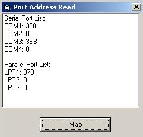



## PortAddress

### Description

Detect address of serial and parallel port.

Read physical memory (on Windows NT/2000/XP)

starting at address 0x400.
 
### More Info
 
Use undocumented API of NTDLL.DLL for

access to physical memory. Use

\device\physicalmemory object of NT core.

Original code published on www.visual-basic.it

Serial and parallel address port.

             |
---                |---
**Submitted On**   |2003-04-13 12:00:04
**By**             |[Antonio Giuliana](https://github.com/Planet-Source-Code/PSCIndex/blob/master/ByAuthor/antonio-giuliana.md)
**Level**          |Intermediate
**User Rating**    |4.8 (19 globes from 4 users)
**Compatibility**  |VB 6\.0
**Category**       |[Miscellaneous](https://github.com/Planet-Source-Code/PSCIndex/blob/master/ByCategory/miscellaneous__1-1.md)
**World**          |[Visual Basic](https://github.com/Planet-Source-Code/PSCIndex/blob/master/ByWorld/visual-basic.md)
**Archive File**   |[PortAddres1573134132003\.zip](https://github.com/Planet-Source-Code/antonio-giuliana-portaddress__1-44713/archive/master.zip)

